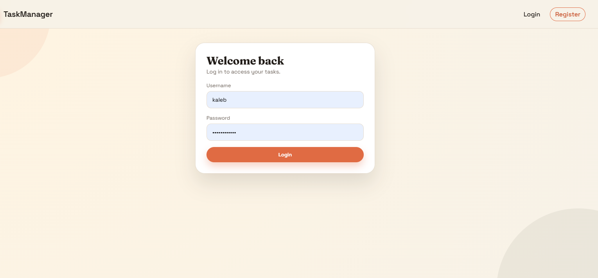
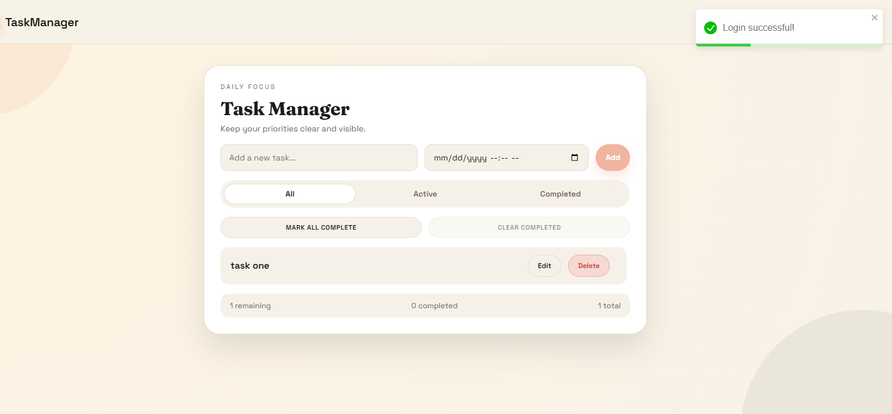
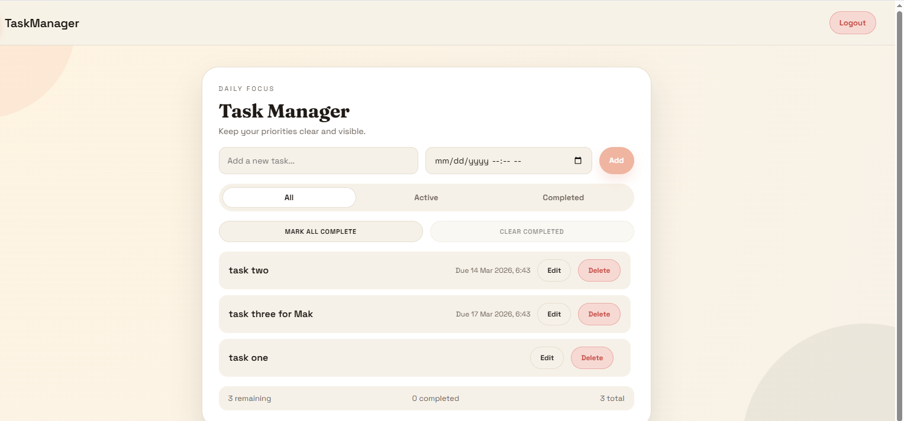

# Task Manager – Fullstack Todo Application

A modern fullstack task management application built with **React and Django REST Framework**.

Users can register, log in, and manage their personal tasks securely using JWT authentication.

---

## 🚀 Live Demo

Frontend
https://javascript-mini-projects-beta.vercel.app/

Backend API
https://todo-django-backend-dtjg.onrender.com/

---

## ✨ Features

* User registration and login
* JWT authentication
* Protected API endpoints
* Create tasks
* Edit tasks
* Delete tasks
* Mark tasks as complete
* Filter tasks (All / Active / Completed)
* Due date support
* Toast notifications
* Automatic logout on token expiration

---

## 🧰 Tech Stack

Frontend

* React
* Axios
* React Router
* React Toastify

Backend

* Django
* Django REST Framework
* SimpleJWT Authentication

Deployment

* Vercel (Frontend)
* Render (Backend)

---

## 📂 Project Structure

Frontend

src

* api
* components
* pages
* utils

Backend

todo_backend

* accounts
* todos
* settings
* API endpoints

---

## 🔑 API Endpoints

Authentication

POST /api/auth/register
POST /api/auth/login
POST /api/auth/token/refresh

Todos

GET /api/todos/
POST /api/todos/
PATCH /api/todos/{id}/
DELETE /api/todos/{id}/

---

## 💻 Run Locally

Frontend

npm install
npm start

Backend

pip install -r requirements.txt
python manage.py migrate
python manage.py runserver

---

## 📸 Screenshots

    
    
    
    

---

## 📌 Future Improvements

* Task categories
* Priority levels
* Email notifications
* Drag-and-drop tasks
* Mobile responsive UI
